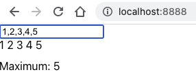
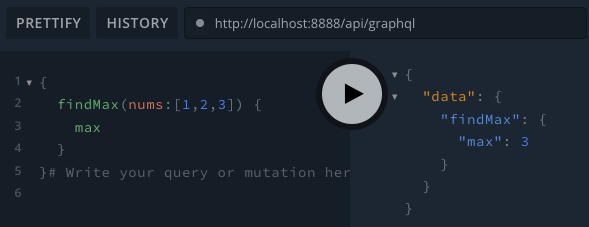
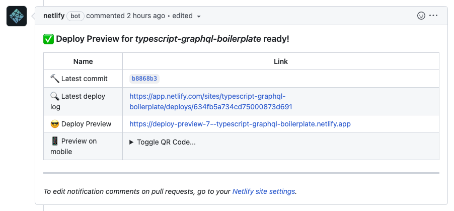

# typescript-graphql-react

A boilerplate project for GraphQL/React monorepos that run on Netlify.

## Overview

This project outlines a sample codebase for a React web app built to be hosted with Netlify, with CI/CD considerations baked in.

#### Front-end React app

This is a simple app which allows a user to input a list of numbers and displays the maximum value.



The specific GraphQL API URL can be specified in the `.env` file found in the project root, and is `localhost:8888/api/graphql` by default.

#### Back-end GraphQL API

The "findMax" functionality is written into a GraphQL API endpoint, which is built to run in Netlify's serverless architecture. In a development environment, you can access the GraphQL API directly:



## Project Structure

```
src
|__ api/           (1)
|__ app/           (2)
|__ functions/     (3)
|__ shared/
   |__ interfaces/ (4)
   |__ types/      (5)
   |__ utils/      (6)
```

1. GraphQL API code defining endpoint resolvers, and helpers to create the GraphQL API server, handler, and schema.

2. Create-React-App Typescript code responsible for creating the front-end React app. It maintains its own `package.json` dependencies and start/build/test scripts.

3. Code defining functions that run as serverless functions on Netlify. 

4. Business logic interfaces. These are not available from within the `app/` directory.

5. Types that are convenient to share between API and App, such as request and response types for GraphQL API endpoints.

6. Utility interfaces. These are not available from within the `app/` directory.

## How to Run

Both the front-end React app and back-end GraphQL serverless API are able to be run locally for local development.

Because Create-React-App siloes its code for building production-ready static files, it's required to "link" some of the shared files from the project directory into the `app/` directory. You can do this by running:

```
npm run link:app
```

Alternatively, for active development, you can start a watcher which will automatically "link" changed files by running:

```
npm run link:watch
```

To run both the front-end React app and the back-end GraphQL serverless API, run:

```
netlify dev
```

The included configuration file will route any API requests from `/api/graphql` to the correct resolvers. 

*Note:* This requires that `netlify` be installed globally on your development environment, which can be done by running `npm install -g netlify`.

#### Testing

To test the API and React app locally, run:

```
npm test
```

To test the API locally, run:

```
npm test:api
```

To test the React app locally, run:

```
npm test:app
```

To lint the project, run:

```
npm run lint
```

#### Productionizing

By default, Netlify should handle the building of the production app. It may be useful to know that running `npm build` will:

- Install dependencies in the `src/app` directory as defined in `src/app/package.json`

- Productionize the front-end React app and migrate static files to `buildapp/`.

- Productionize the back-end GraphQL API and migrate JavaScript files to `build/`.

## Methodology

This repository was made for the purpose of providing a boilerplate for Typescript/React/GraphQL apps to be run with Netlify in a scalable and maintainable way which is easy and pleasant to build on top of.

To that end, the following comes pre-configured in various configuration files:

- `test:ci` is run automatically on pull-requests into the main branch via GitHub actions. This is configured in `.github/workflows/ci.yml`.

- Netlify automatically deploys serverless functions and the front-end React app. This is configured in `netlify.toml`.

- For developers using VS Code, only project-relevant files are displayed. This is configured in `.vscode/settings.json`.

#### Adding a new data flow and component

Suppose we want to build a new component which displays the median value of some inputted numbers.

##### Business logic

First, we write the tests for our new business logic into the `BasicMath` interface tests found in `src/shared/interfaces/__tests__/BasicMathInterface.test.ts`.

```
describe('findMedian', () => {
  it('should correctly find the median value in a list of numbers', () => {
    const testNums: number[] = [11000, 1, 8589, 39, 10000, 3, 6];
    const expectedMedian: number = 39;
    const actualMedian: number = basicMath.findMedian(testNums);
    expect(actualMedian).toBe(expectedMedian);
  });
});
```

This test will fail because there is no `findMedian` method in the `BasicMathInterface`, so let's write one into `src/shared/interfaces/BasicMathInterface.ts`.

```
/**
  * Given a list of numbers, return the highest.
  * @param nums A list of numbers.
  */
findMedian(nums: number[]): number {
  const sortedNums: number[] = nums.sort((a, b) => a - b);
  const middleIndex: number = Math.ceil(nums.length / 2);
  return sortedNums[middleIndex];
}
```

#### GraphQL API endpoint

Let's build this functionality into a GraphQL endpoint so that we can access it from our front-end React app.

First, we'll write the types of our new endpoint in `src/shared/types/api/FindMedianResolverTypes.ts`

```
@ArgsType()
export class FindMedianResolverArgs {
  @Field(() => [Number])
    nums: number[];
}

@ObjectType()
export class FindMedianResolverResponse {
  @Field(() => Number)
    median: number;
}
```

Then, we'll write the tests for our new endpoint in `src/api/resolvers/__tests__/FindMedianResolver.test.ts`.

```
it('finds the maximum value in a list of numbers', async () => {
  const response: GraphQLResponse = await server.executeOperation({
    query: gql`
      {
        findMedian(nums:[11000, 1, 8589, 39, 10000, 3, 6]) {
          median,
        }
      }
    `,
  });
  const { median } = response.data?.findMedian as FindMedianResolverResponse;
  expect(median).toBe(42);
});
```

This test will fail because we haven't built the resolver yet. Let's do that now in `src/api/resolvers/FindMedianResolver.ts`

```
interface IFindMedianResolver {
  findMedian(args: FindMedianResolverArgs): FindMedianResolverResponse,
}

@Resolver()
export default class FindMedianResolver implements IFindMedianResolver {
  @Query(() => FindMedianResolverResponse)
  findMedian(@Args(() => FindMedianResolverArgs) {
    nums,
  }: FindMedianResolverArgs): FindMedianResolverResponse {
    const basicMath: BasicMath = new BasicMath();
    const median: number = basicMath.findMedian(nums);
    return { median };
  }
}
```

Now, we can test locally by running `netlify dev` and check our new endpoint by querying it directly (the API can be found at `localhost:8888/api/graphql`);

#### React component

The first step to building our new React component is to write the query which will pull the data we need to hydrate it. We can do that by creating a new query in `src/app/src/queries/FindMedianQuery.tsx`.

```
export const FindMedianQuery = gql`
  query FindMedian($numbers: [Float!]!) {
    findMedian(nums: $numbers) {
      median
    }
  }
`;
```

This query can then be referenced in a `react-apollo` `<Query>` component to automatically pull data from our API.

```
<Query query={FindMedianQuery} variables={{ numbers }}>
  {renderFromResponse}
</Query>
```

Our rendering function might look as follows:

```
function renderFromResponse(response: FindMaxQueryResponse): JSX.Element {
  const { error, data, loading } = response;
  if (error !== undefined) {
    return <p>There was an error.</p>;
  }
  if (loading) {
    return <p>Loading...</p>;
  }
  if (data !== undefined && data.findMedian !== undefined) {
    return <p>Median: {data.findMedian.median}</p>;
  }
  return <p>Please try again.</p>;
}
```

#### Overview

We now have access to this data in the front-end, and can use it accordingly. In summary, we:

- Built new business logic into an existing interface

- Surfaced that logic in a GraphQL endpoint

- Queried that endpoint from the front-end using a GraphQL query

- Hydrated a React component with that data

When the branch we're working on is complete, we can file a pull request. This will automatically deploy a version of our app and API that we can manually review before approving the app. The pull request will automatically perform a status check against the testing and linting included in `test:ci` as well, and won't allow a merge until these pass.

